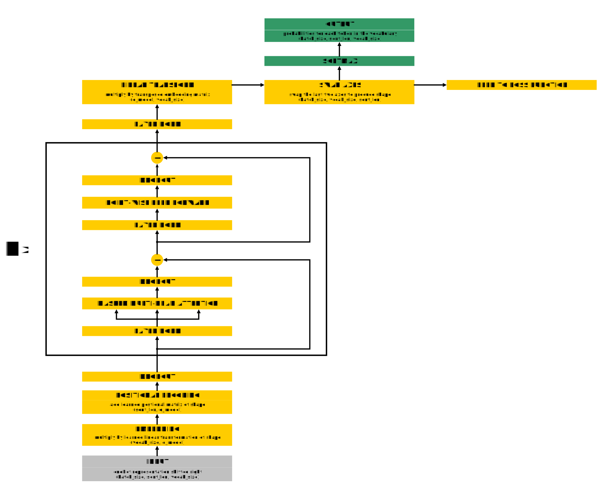

# PyTorch implementation of GPT/GPT-2 from scratch from the original papers"Improving Language Understanding by Generative Pre-Training" and "Language Models are Unsupervised Multitask Learners".

Originally published on [*my site*](https://alexgrishin.ai/pytorch_implementation_of_gpt).
<br /><br />

This is a PyTorch implementation of GPT/GPT-2 from the original papers
[*GPT*](https://s3-us-west-2.amazonaws.com/openai-assets/research-covers/language-unsupervised/language_understanding_paper.pdf) 
  and [*GPT-2*](https://d4mucfpksywv.cloudfront.net/better-language-models/language_models_are_unsupervised_multitask_learners.pdf)
   (Alec Radford et al.).
  GPT is coded from scratch in "vanilla" PyTorch without use of PyTorch transformer classes.
  The model was trained on a (non negligible) fraction of The Pile dataset.
  The main goal of the project was to see how far one can go in terms of training the GPT family of models
  on a relatively serious size corpus with
  only one 8Gb GPU.

  Only the smallest model can fit in such low GPU memory,
  and 8Gb memory also imposes truly harsh limitations on batch size. I budgeted two months of training time for the project
which forced me to downsize to a 21.5 bln tokens subset of The Pile, on which I could train the model for one epoch.

The resulting undertrained model, however, produces sensible results. If we don't push it far and restrain prompt completions to (a very modest number of) 20 tokens, it generates reasonable completions. After that limit it starts repeating itself - the behaviour also observed in the original GPT. The model achieves perplexity of 19.35 on the validation set.

### Dataset and preprocessing

[*The Pile dataset*](https://arxiv.org/pdf/2101.00027.pdf) is a diverse collection
of 22 subsets of different origins with overall effective size of ~1.3Tb. The whole dataset is split between
thirty jsonl files (0.jsonl, 1.jsonl, ..., 29.jsonl) each of which is about 45Gb in size. Each line in each jsonl file
corresponds to a document from one of 22 subsets. Documents from all subsets are distributed randomly across all jsonl
files, so each file has roughly the same composition of subsets. Each line is a dictionary containing (apart from
other info, which I'm not using) document text and subset name this document belongs to.

My preprocessing procedure consists of 4 steps. Scripts corresponding to these steps use the \[preprocessing\]
section of the config file, which looks like that:

**\[preprocessing\]**<br>
path_to_original_data=/media/alex/data2/GPT2_data/ThePile/pile/train/<br>
path_to_store_preprocessed_data=/media/alex/data1/GPT2_data/data/<br>
pile_sets_to_use=FreeLaw|HackerNews|Books3|OpenWebText2|Gutenberg (PG-19)|Pile-CC|BookCorpus2|Wikipedia (en)|PubMed Abstracts<br>
max_len_words=256<br>
min_len_words=16<br>SS
max_len_tokens=512<br>
max_num_of_tokens_in_batch=2100<br>

Below is a description of preprocessing scripts.

#### Step 0 - filter and truncate

As my computational resourses were
extremely limited, I decided not even to attempt to train the model on anything but plain English. So, I
filtered out subsets which are heavy on code examples, math equations, chemical formulas, etc.
The parameter pile_sets_to_use in the config file controls what subsets will be used.
These are the subsets I kept (in size descending order):
<ul>
<li>Pile-CC</li>
<li>Books3</li>
<li>OpenWebText2</li>
<li>FreeLaw</li>
<li>PubMed Abstracts</li>
<li>Gutenberg (PG-19)</li>
<li>Wikipedia (en)</li>
<li>BookCorpus2</li>
<li>HackerNews</li>
</ul>

They comprise roughly 55% of the full Pile dataset.

Having in mind that I will later impose restrictions on context size in tokens,
I truncated documents with more than max_len_words (256 in my case) words, which was a substantial cut.
I also threw away all documents which had less than min_len_words (16 in my case) words in them (there were
very few of those).

Here's how to run step 0:
```
$ python3 0_filter_sets_truncate_long.py --chunk_num=0
```
The command line parameter --chunk_num can take values from 0 to 29 and corresponds to different
  original jsonl files (chunks).

#### Step 1 - save tokenizer
```
$ python3 1_save_tokenizer.py
```
This simply downloads GPT-2 tokenizer, adds BOS token, and saves the tokenizer to the disk.
The vocabulary size is 50258.

#### Step 2 - tokenize
```
$ python3 2_tokenize.py --chunk_num=0
```
This tokenizes all documents. Documents with number of tokens higher than max_len_tokens (512 in my case)
get truncated.

#### Step 3 - form batches
```
$ python3 3_form_batches.py --chunk_num=0
```
To reduce the load on the runtime dataloader I form batches in advance, during the preprocessing stage.
I do not have a fixed number of documents in a batch, instead
I impose a limit on how many tokens in total there could be. This limit is controlled by the
parameter max_num_of_tokens_in_batch (2100 in my case - can't go any higher with a 8GB GPU).
When forming a batch I only use documents of the same
size (so, there is never a need for padding) and I try to get as close to the tokens limit as possible.
This way batches of shorter documents end up having larger batch sizes, and batches of longer documents have
smaller batch sizes. The longest documents have 513 tokens (BOS token + 512 regular vocabulary tokens),
which translates into a batch size of 4.

With this approach, at train time I, of course, can only shuffle order of batches, I can't change
 the batches composition. I reckoned that shuffling order of batches within each chunk and order of chunks within each epoch
 should be good enough. And since I could only run for one epoch it didn't matter anyway.

#### Step 4 - create a validation chunk
```
$ python3 4_create_val_chunk.py
```
Although it is a preprocessing script, it uses parameters from the \[val\] sections of config, which in my case looks like this:

**\[val\]**<br>
data_from_what_chunk_to_use=29<br>
chunk_num_val=290<br>
num_of_docs=10000<br>

As with my config, chunk 29 isn't used in training, it can safely be utilized for validation purposes. So, the script takes a number of random batches from the chunk 29 with the total number of documents approximately equal to 10,000, and then packs them into a newly created chunk 290. This chunk will later be used to determine perplexity of the model.

### The model

The first GPT paper
"Improving Language Understanding by Generative Pre-Training"
  shows an architecture diagram, while the second "Language Models are Unsupervised Multitask Learners"
  (GPT-2 paper) just explains in words what changes were introduced in GPT-2. As there is no GPT-2 architecture
  diagram in the original papers I could refer to, I display it here:

<figure>
    
    <figcaption style="font-size:0.4em;">GPT-2 architecture. Note that layer norm positions are different from the diagram
      in "Improving Language Understanding by Generative Pre-Training".
       The yellow blocks show training operations, the green show
    how inference differs from training. There's no softmax during training as it is more optimal
    to feed not normalized logits to PyTorch cross entropy loss function.</figcaption>
</figure>